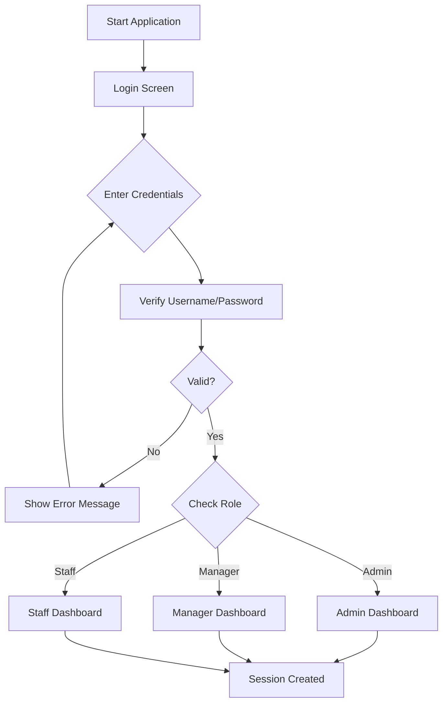

# Porsche Management System - Project Flowchart

## 🎯 System Overview

```
┌─────────────────────────────────────────────────────────────────┐
│                    PORSCHE MANAGEMENT SYSTEM                     │
│                   (JavaFX Desktop Application)                   │
└─────────────────────────────────────────────────────────────────┘
```

---

## 📊 High-Level Architecture

```
┌──────────────┐
│   Launcher   │ ──► Main Entry Point
└──────┬───────┘
       │
       ▼
┌──────────────┐
│ Login Screen │ ──► Authentication
└──────┬───────┘
       │
       ├─────► [Admin Dashboard]
       │
       ├─────► [Manager Dashboard]
       │
       └─────► [Staff Dashboard]
```

---

## 🔐 Authentication Flow



---

## 👤 User Roles & Access

### 1️⃣ **ADMIN Role**

```
┌─────────────────────┐
│  Admin Dashboard    │
└──────────┬──────────┘
           │
           ├──► Overview (Analytics & Statistics)
           │    ├─ Total Sales
           │    ├─ Revenue Charts
           │    └─ System Metrics
           │
           ├──► Accounts Management
           │    ├─ View Staff/Manager List
           │    ├─ Add New Users
           │    ├─ Edit User Details
           │    ├─ Active/Inactive Toggle
           │    ├─ View Performance
           │    ├─ Attendance Tracking
           │    └─ Target Management
           │
           ├──► Orders Management
           │    ├─ View All Orders (by Month/Year)
           │    ├─ Search Orders by Car Model
           │    ├─ Order Statistics
           │    └─ Order Status Tracking
           │
           └──► Settings
                ├─ Change Password
                └─ System Configuration
```

### 2️⃣ **MANAGER Role**

```
┌─────────────────────┐
│ Manager Dashboard   │
└──────────┬──────────┘
           │
           ├──► Overview
           │    ├─ Sales Performance
           │    ├─ Staff Performance
           │    └─ Weekly/Monthly Charts
           │
           ├──► Staff View
           │    ├─ View Staff Details
           │    ├─ Attendance Records
           │    ├─ Performance Metrics
           │    └─ Target Achievement
           │
           ├──► Inventory Management
           │    ├─ View Products
           │    ├─ Stock Levels
           │    ├─ Add/Edit Products
           │    └─ Low Stock Alerts
           │
           └──► Order Management
                ├─ View Orders
                ├─ Filter by Date
                └─ Order Details
```

### 3️⃣ **STAFF Role**

```
┌─────────────────────┐
│  Staff Dashboard    │
└──────────┬──────────┘
           │
           ├──► Welcome Screen
           │
           ├──► Car Selection
           │    ├─ Browse Car Models
           │    ├─ View Car Details
           │    └─ Select Car
           │
           ├──► Customization
           │    ├─ Choose Exterior Color
           │    ├─ Choose Interior
           │    ├─ Select Wheels
           │    ├─ Add Accessories
           │    └─ View Price Updates
           │
           ├──► Shopping Cart
           │    ├─ Internal Cart (Car Configuration)
           │    ├─ External Cart (Additional Parts)
           │    ├─ View Total Price
           │    └─ Modify Items
           │
           ├──► Finalize Order
           │    ├─ Customer Information
           │    ├─ Order Summary
           │    ├─ Payment Details
           │    └─ Submit Order
           │
           └──► Tools & Assets
                ├─ View Best Sellers
                └─ Product Catalog
```

---

## 🔄 Complete User Journey Flow

### **Admin Journey**

```
Login → Admin Dashboard
  │
  ├─ View Overview
  │   └─ See system-wide analytics
  │
  ├─ Manage Accounts
  │   ├─ Click "Accounts" tab
  │   ├─ View staff list (Active/Inactive)
  │   ├─ Search by name/ID
  │   ├─ Select staff member
  │   ├─ View details (attendance, targets, sales)
  │   ├─ Select month/year for data
  │   └─ Add new user (Register form)
  │
  ├─ Manage Orders
  │   ├─ Click "Orders" tab
  │   ├─ Select month/year
  │   ├─ Search by car model (e.g., "911")
  │   ├─ View order statistics
  │   └─ See filtered results
  │
  └─ Settings
      └─ Change password with OTP verification
```

### **Manager Journey**

```
Login → Manager Dashboard
  │
  ├─ View Overview
  │   └─ See sales and staff performance
  │
  ├─ Staff Management
  │   ├─ View staff cards
  │   ├─ Select staff member
  │   ├─ View attendance
  │   └─ Track targets
  │
  ├─ Inventory
  │   ├─ View all products
  │   ├─ Check stock levels
  │   ├─ Add new products
  │   └─ Edit existing items
  │
  └─ Orders
      ├─ View order list
      ├─ Filter by date range
      └─ View order details
```

### **Staff Journey (Order Creation)**

```
Login → Staff Dashboard
  │
  ├─ Welcome Screen
  │   └─ Start new order
  │
  ├─ Car Selection
  │   ├─ Browse available models
  │   ├─ View specifications
  │   └─ Select car model
  │
  ├─ Customization
  │   ├─ Choose exterior color
  │   ├─ Choose interior style
  │   ├─ Select wheel design
  │   ├─ Add accessories
  │   └─ See live price calculation
  │
  ├─ Shopping Cart
  │   ├─ Review internal cart (car config)
  │   ├─ Review external cart (parts)
  │   ├─ Modify quantities
  │   └─ Proceed to checkout
  │
  └─ Finalize Order
      ├─ Enter customer details
      │   ├─ Name
      │   ├─ Email
      │   ├─ Phone
      │   └─ Address
      ├─ Review order summary
      ├─ Confirm payment method
      └─ Submit order
          └─ Order saved to database
```

---

## 🗄️ Database Interaction Flow

```
┌──────────────────┐
│   Controllers    │
└────────┬─────────┘
         │
         ▼
┌──────────────────┐
│      DAO         │ ──► Data Access Objects
│  (AdminAccountDAO,│     (Business Logic)
│   ChartDAO,      │
│   userDAO)       │
└────────┬─────────┘
         │
         ▼
┌──────────────────┐
│  Database Layer  │
│  (Porsche_DB,    │ ──► Connection Management
│   DatabaseConn   │
│   Manager)       │
└────────┬─────────┘
         │
         ▼
┌──────────────────┐
│  MySQL Database  │ ──► Data Storage
│  - users         │
│  - orders        │
│  - products      │
│  - customers     │
│  - attendance    │
│  - targets       │
└──────────────────┘
```

---

## 🔧 Key Features Flow

### **Change Password Flow**

```
Settings → Change Password
  │
  ├─ Step 1: Verify Current Password
  │   ├─ Enter current password
  │   ├─ Click "Verify"
  │   └─ System validates against database
  │
  ├─ Step 2: OTP Verification
  │   ├─ System sends OTP to email
  │   ├─ User enters OTP
  │   ├─ Click "Verify OTP"
  │   └─ System validates OTP
  │
  └─ Step 3: Set New Password
      ├─ Enter new password
      ├─ Confirm new password
      ├─ Click "Change Password"
      └─ Password updated in database
```

### **Order Search Flow (Admin)**

```
Admin Orders Page
  │
  ├─ Select Month/Year
  │   └─ Load orders for selected period
  │
  ├─ Enter Search Term (e.g., "911")
  │   ├─ System searches in real-time
  │   ├─ Queries order_details table
  │   ├─ Joins with products table
  │   └─ Filters by product_name
  │
  └─ Display Results
      ├─ Show filtered orders
      ├─ Update "Total Orders" count
      └─ Update "Searched Orders" count
```

### **Staff Performance Tracking (Admin)**

```
Admin Accounts Page
  │
  ├─ Select Staff Member
  │   └─ Load staff details
  │
  ├─ Select Month/Year
  │   └─ Fetch data for period
  │
  ├─ Display Metrics
  │   ├─ Weekly Sales Chart
  │   │   └─ Shows sales per week
  │   │
  │   ├─ Attendance Circle
  │   │   └─ Shows attendance percentage
  │   │
  │   └─ Target Achievement
  │       ├─ Car Sales Target
  │       │   ├─ Achieved vs Target
  │       │   └─ Over/Under indicator
  │       │
  │       └─ Parts Sales Target
  │           ├─ Achieved vs Target
  │           └─ Over/Under indicator
  │
  └─ Navigate Months/Years
      ├─ Previous/Next Month buttons
      └─ Previous/Next Year buttons
```

---

## 🎨 UI Component Hierarchy

```
Application Window
│
├─ Login Screen
│   ├─ Video Background (optional)
│   ├─ Logo Images
│   ├─ Username Field
│   ├─ Password Field
│   └─ Login Button
│
├─ Admin Dashboard
│   ├─ Navigation Sidebar
│   │   ├─ Overview
│   │   ├─ Accounts
│   │   ├─ Orders
│   │   └─ Settings
│   │
│   └─ Content Area (Dynamic)
│       ├─ Overview Charts
│       ├─ Accounts Management
│       ├─ Orders Table
│       └─ Settings Forms
│
├─ Manager Dashboard
│   ├─ Navigation Sidebar
│   └─ Content Area
│
└─ Staff Dashboard
    ├─ Navigation Sidebar
    └─ Content Area
        ├─ Car Selection Grid
        ├─ Customization Panel
        ├─ Shopping Cart
        └─ Finalization Form
```

---

## 📦 Project Structure

```
Porsche/
│
├─ src/main/java/
│   ├─ Controllers/          (33 controllers)
│   │   ├─ loginController
│   │   ├─ admin*.java       (Admin features)
│   │   ├─ manager*.java     (Manager features)
│   │   ├─ staff*.java       (Staff features)
│   │   └─ ChangePasswordController
│   │
│   ├─ DAO/                  (Data Access)
│   │   ├─ AdminAccountDAO
│   │   ├─ ChartDAO
│   │   └─ userDAO
│   │
│   ├─ Database/             (Connection)
│   │   ├─ Porsche_DB
│   │   └─ DatabaseConnectionManager
│   │
│   ├─ Model/                (Data Models)
│   │   ├─ user
│   │   ├─ order
│   │   ├─ car
│   │   ├─ customer
│   │   └─ inventory
│   │
│   ├─ Utils/                (Utilities)
│   │   ├─ Session
│   │   ├─ ThreadPoolManager
│   │   ├─ OTPService
│   │   └─ defaultStage
│   │
│   └─ MainUI/               (Entry Point)
│       ├─ Launcher
│       └─ login
│
├─ src/main/resources/
│   ├─ View/                 (FXML files)
│   ├─ CSS/                  (Stylesheets)
│   ├─ application.properties
│   └─ logback.xml
│
└─ pom.xml                   (Maven config)
```

---

## 🔄 Data Flow Summary

```
User Input
    ↓
Controller (UI Logic)
    ↓
DAO (Business Logic)
    ↓
Database Layer (Connection)
    ↓
MySQL Database
    ↓
Result Set
    ↓
Model Objects
    ↓
Controller (Update UI)
    ↓
Display to User
```

---

## 🚀 Application Lifecycle

```
1. Application Start
   └─ Launcher.main() → login.launch()

2. Login Phase
   └─ loginController.initialize()
   └─ User authentication
   └─ Session.getInstance().setUser()

3. Dashboard Phase
   └─ Load appropriate dashboard based on role
   └─ Initialize controllers
   └─ Load data from database
   └─ Display UI

4. User Interaction
   └─ Button clicks / Form submissions
   └─ Controller handles events
   └─ DAO processes business logic
   └─ Database operations
   └─ UI updates

5. Logout / Exit
   └─ Session cleanup
   └─ Close database connections
   └─ Application exit
```

---

## 📊 Key Technologies

- **Frontend:** JavaFX (FXML + Controllers)
- **Backend:** Java 17
- **Database:** MySQL
- **Build Tool:** Maven
- **Logging:** SLF4J + Logback
- **Connection Pooling:** Custom DatabaseConnectionManager
- **Threading:** ThreadPoolManager for async operations
- **Authentication:** Session-based with OTP support

---

## 🎯 Core Functionalities

1. **User Management** - Admin can manage all users
2. **Order Processing** - Staff creates orders, Admin/Manager views
3. **Inventory Management** - Manager controls stock
4. **Performance Tracking** - Admin tracks staff metrics
5. **Sales Analytics** - Charts and statistics
6. **Attendance System** - Track staff attendance
7. **Target Management** - Set and monitor sales targets
8. **Search & Filter** - Advanced order and user search
9. **Real-time Updates** - Async data loading
10. **Secure Authentication** - Password + OTP verification

---

*Generated on: 2025-10-11*
*Project: Porsche Management System*
